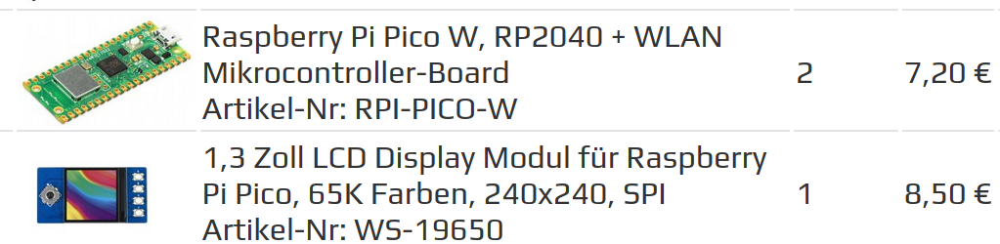

# rpi-pico-lcd
Example project for raspberry pico with lcd 240px board



## Start

Press and hold the button on the Pico board, connect Pico to the USB port of the computer through the Micro USB cable, and then release the button.
After connecting, the computer will automatically recognize a removable disk (RPI-RP2)
    
Copy the **rp2-pico-20210418-v1.15.uf2** file in the python directory to the recognized 
removable disk (RPI-RP2)

Update Thonny IDE
```bash
sudo apt upgrade thonny
```

Open Thonny IDE （Click raspberry logo -Programming -Thonny Python IDE ）

    select Tools -Options... -Interpreter
    select MicroPython(Raspberry Pi Pico  and ttyACM0 port
    
Open the python/Pico-OLED-1.3/Pico-OLED-1.3(spi).py file in Thonny IDE
Then run the current script (green triangle)


## Pico LCD 1.3

1.3inch LCD Display Module For Raspberry Pi Pico, 65K RGB Colors, 240 × 240 Pixels, SPI Interface.
Features

    240 × 240 resolution, IPS screen, 65K RGB colors, clear and colorful displaying effect
    SPI interface, requires minimal IO pins
    1 x joystick and 4 x user buttons for easy interaction

Specifications

    Operating voltage: 2.6~5.5V
    Resolution: 240 × 240 pixels
    Communication interface: 4-wire SPI
    Display size: 23.40 × 23.40mm
    Display panel: IPS
    Pixel size: 0.0975 × 0.0975mm
    Driver: ST7789
    Dimensions: 52.00 × 26.50mm


## Resource

+ [Pico LCD 1.3 - Waveshare Wiki](https://www.waveshare.com/wiki/Pico-LCD-1.3)
+ [JetBrains/intellij-micropython: Plugin for MicroPython devices in PyCharm and IntelliJ](https://github.com/JetBrains/intellij-micropython)
+ [RPi-Distro](https://github.com/RPi-Distro)
+ [Raspberry Pi Learning Resources](https://github.com/orgs/raspberrypilearning/repositories?type=all)
+ [Project path | Introduction to the Raspberry Pi Pico](https://projects.raspberrypi.org/en/pathways/pico-intro)
+ [thonny/thonny: Python IDE for beginners](https://github.com/thonny/thonny/)
+ [Pico LCD 1.3 - Waveshare Wiki](https://www.waveshare.com/wiki/Pico-LCD-1.3)


## Document

+ [Schematic](https://www.waveshare.com/w/upload/b/bf/Pico-LCD-1.3_SchDoc.pdf)
+ [ST7789VW Datasheet](https://www.waveshare.com/w/upload/a/ad/ST7789VW.pdf)

## Examples

+ [Demo codes](https://www.waveshare.com/w/upload/2/28/Pico_code.7z)
+ [raspberrypi/pico-examples](https://github.com/raspberrypi/pico-examples)


[Raspberry Pi Documentation - Raspberry Pi Pico and Pico W](https://www.raspberrypi.com/documentation/microcontrollers/raspberry-pi-pico.html)

## [](https://www.raspberrypi.com/documentation/microcontrollers/raspberry-pi-pico.html#technical-specification)Raspberry Pi Pico and Pico H

Raspberry Pi Pico is a low-cost, high-performance microcontroller board with flexible digital interfaces. Key features include:

-   [RP2040](https://www.raspberrypi.com/documentation/microcontrollers/rp2040.html#welcome-to-rp2040) microcontroller chip designed by Raspberry Pi in the United Kingdom
    
-   Dual-core Arm Cortex M0+ processor, flexible clock running up to 133 MHz
    
-   264kB of SRAM, and 2MB of on-board flash memory
    
-   USB 1.1 with device and host support
    
-   Low-power sleep and dormant modes
    
-   Drag-and-drop programming using mass storage over USB
    
-   26 × multi-function GPIO pins
    
-   2 × SPI, 2 × I2C, 2 × UART, 3 × 12-bit ADC, 16 × controllable PWM channels
    
-   Accurate clock and timer on-chip
    
-   Temperature sensor
    
-   Accelerated floating-point libraries on-chip
    
-   8 × Programmable I/O (PIO) state machines for custom peripheral support
- 
[Raspberry Pi Documentation - Raspberry Pi Pico and Pico W](https://www.raspberrypi.com/documentation/microcontrollers/raspberry-pi-pico.html)

### Pinout and design files


### PicoW


-   Download the [Pinout Diagram](https://datasheets.raspberrypi.com/pico/Pico-R3-A4-Pinout.pdf) (PDF)
    
-   Download [Design Files](https://datasheets.raspberrypi.com/pico/RPi-Pico-R3-PUBLIC-20200119.zip) (Cadence Allegro)
    
-   Download [STEP File](https://datasheets.raspberrypi.com/pico/Pico-R3-step.zip)
    
-   Download [Fritzing Part](https://datasheets.raspberrypi.com/pico/Pico-R3-Fritzing.fzpz) for Raspberry Pi Pico
    
-   Download [Fritzing Part](https://datasheets.raspberrypi.com/pico/PicoH-Fritzing.fzpz) for Raspberry Pi Pico H